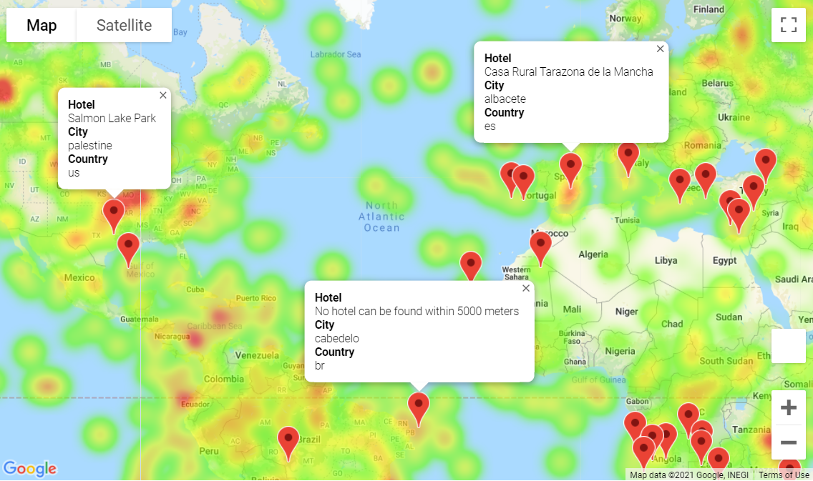

# rice-btcmp-hw6-python-api-challenge
## Project objective

Use Python requests, APIs and JSON traversals to answer a fundamental question: "What's the weather like as we approach the equator?"

## Part I - WeatherPy

Create a Python script to visualize the weather of 500+ cities across the world of varying distance from the equator, utilizing [CitiPy Python library](https://pypi.python.org/pypi/citipy) & [OpenWeatherMap API](https://openweathermap.org/api) to create a representative model of weather across world cities.

Code produces a series of scatter plots to showcase the following relationships:

- Temperature (F) vs. Latitude
- Humidity (%) vs. Latitude
- Cloudiness (%) vs. Latitude
- Wind Speed (mph) vs. Latitude

Run linear regression on each relationship, only this time separating them into Northern Hemisphere (greater than or equal to 0 degrees latitude) and Southern Hemisphere (less than 0 degrees latitude):

- Northern Hemisphere - Temperature (F) vs. Latitude
- Southern Hemisphere - Temperature (F) vs. Latitude
- Northern Hemisphere - Humidity (%) vs. Latitude
- Southern Hemisphere - Humidity (%) vs. Latitude
- Northern Hemisphere - Cloudiness (%) vs. Latitude
- Southern Hemisphere - Cloudiness (%) vs. Latitude
- Northern Hemisphere - Wind Speed (mph) vs. Latitude
- Southern Hemisphere - Wind Speed (mph) vs. Latitude

Include a print log of each city as it's being processed with the city number & city name and save a CSV file of all retrieved data and a PNG images for the scatter plots.

### Part II - VacationPy

Use retrieved weather data to plan future vacations using <i>jupyter-gmaps</i>i and the <i>Google Places API</i>.

- Create a heat map that displays the humidity for every city from the *Part I* of the homework.
- Narrow down the DataFrame to find your ideal weather condition. For example:
  - Using a [min, max] range for temperature.
  - Maximum wind speed.
  - Maximum cloudiness.
  - Drop any rows that don't contain all three conditions. You want to be sure the weather is ideal.
- Use Google Places API to find the first hotel for each city located within 5000 meters of given set of coordinates.
- Plot the hotels on top of the humidity heatmap with each pin containing the **Hotel Name**, **City**, and **Country**.

### Input data:

No input data is provided for **WeatherPy**, as city locations are to be generated randomly. Output of **WeatherPy** is then used by **VacationPy** as input.

### Observations:

1. Analysis of 1000 data points (cities) is presented in the figure below. We can qualitatively observe that temperatures decrease away from the equator (latitude =0). 

   

2. Now, if we color code the data points based on which hemisphere they belong to we will see the observation even clearer, as shown below. 

   

3. Performing linear regression over the hemisphere-based subsets of data allows us to further assess nature of the relationship. Comparing impact of proximity to the equator on temperature (a) vs other properties (humidity (b), cloudiness (c) & wind speed(d)), we can see a much stringer correlation. 

   

4. Wind speed & Humidity regression fit shows very similar range, while for cloudiness, it seems that Northern Hemisphere is slightly cloudier than the Southern one.

5. Final city_data collected was formatted as a Data Frame and exported into [city_data.csv](WeatherPy/city_data.csv) . Sample of the final data table is displayed below (sorted by Hemisphere, Country and City Name):

   

6. Having imported content of the  [city_data.csv](WeatherPy/city_data.csv), we then used <i>jupyter-gmaps</i> to generate a heat map that displays the humidity for every city in the generated dataset.

   

7. The Data Frame was then narrowed based on the following conditions:

   * 70 deg F < Temperature, deg F < 85 deg F;
   * wind speed < 10 mph;
   * cloudiness = 0 %.

8. City locations from the resulting data frame were then fed to Google Places API which pulled names of first hotel located within 5000 m of the provided (lat,lon) location coordinate pair. The heatmap was then overlaid by a marker layer where each pin represented selected "ideal" location and marker's tooltip contained information about the hotel (if hotel existed), while a message was printed notifying the user if no hotels were found within the specified radius.

   
